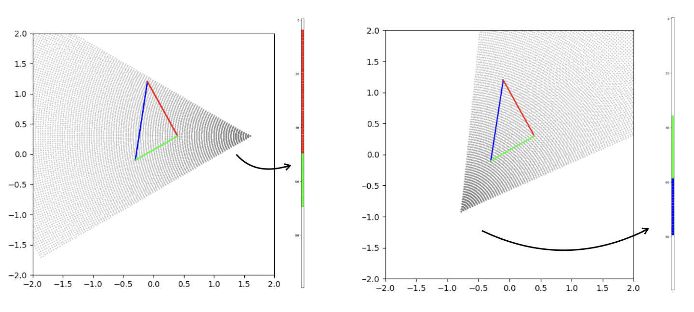
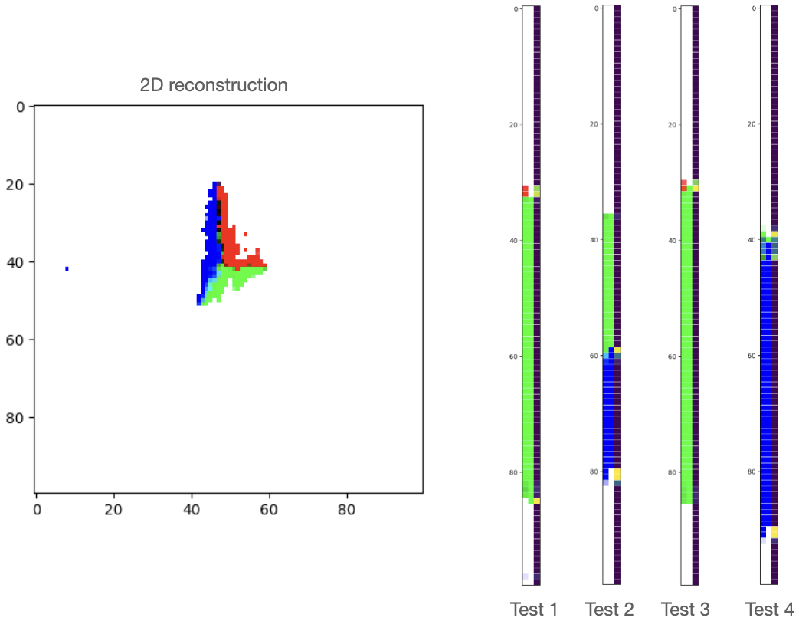

# NeRF 2D Projection 1D

This is a repo for NeRF on 2D reconstruction, the data are not random grid points but projected points to various views. This repo is contributed to foundamental researches on experimenting properties of neural solver for the inverse problem in the field of reconstruction.

some codes are transfered from 3D NeRF refer to [link](https://github.com/yenchenlin/nerf-pytorch/tree/master)

## Data Generation

The 2D shape can be defined in the config under ```dataset``` directory. Here is an example of the data created from 2D triangle:



## Model setup and config

Model should be registered in ```models/__init__.py```, and the config of the model should be put in ```configs/model_configs/{model_name}_conf.py```

## Training and visualization

Here is a reconstruction results in the global view with 1000 iterations training on vanilla NeRF by the data ```dataset/cache/dataset_cache.joblib```. The visualization of test results are concatenation of [prediction, ground truth, diff heatmap]




## TODO List
- [x] positional embeddings
- [ ] models
    - [x] vanilla NeRF
    - [ ] 3dgs
    - [ ] instant-ngp
- [x] training
- [x] evaluation and visualization
- [x] camera (pinhole), ray casting
- [x] camera distribution